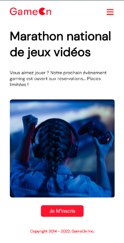
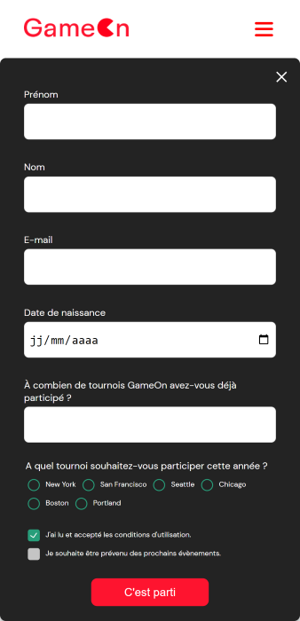

# Projet GameOn 

## Créez une landing page avec Javascript dans le cadre de la formation Développeur d'Aplication JavaScript React

-------------------------------------------------------------

***<h1 align="center">Travail sur la validation de formulaire par JavaScript</h1>***

<h2 align="center">Projet dans le cadre de la formation développeur d'application JavaScript React</h2> 

Pour voir le résultat du site web mis en ligne, rendez-vous sur [GameOn](https://palacioscaroline.github.io/projet4/index.html)


***********************************************************************************************************************************************************************

```diff	
@@ Exemple: Image of site @@
```






***********************************************************************************************************************************************************************

